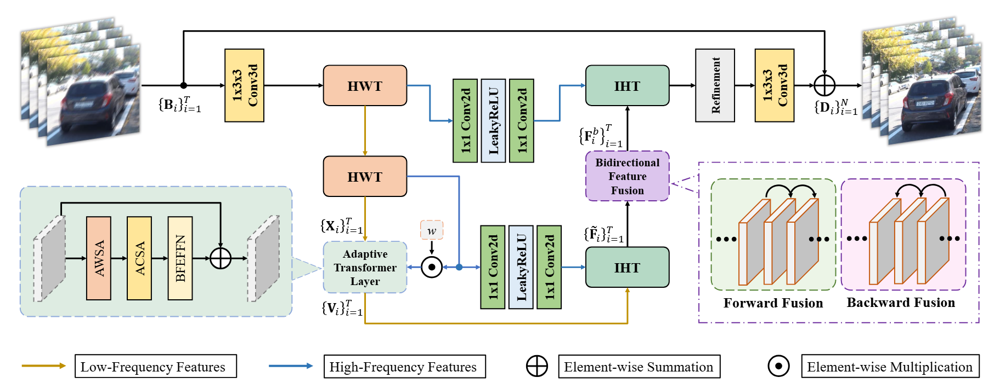
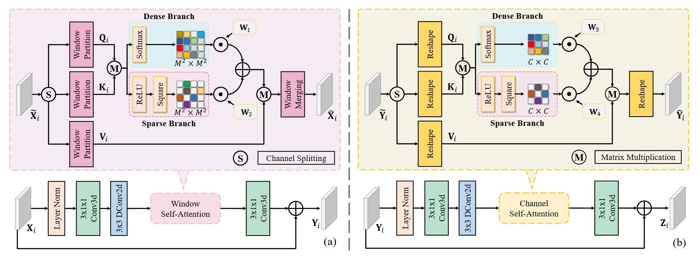
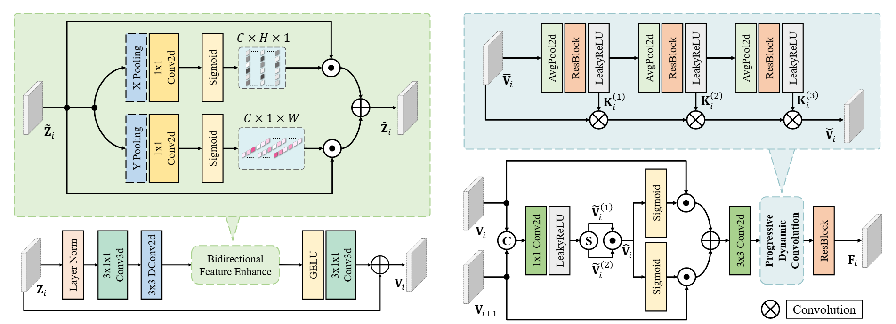
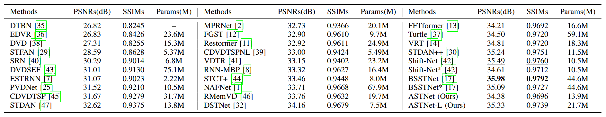
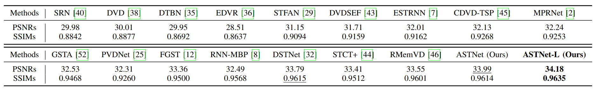
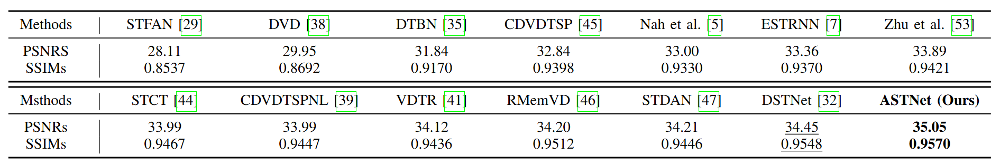
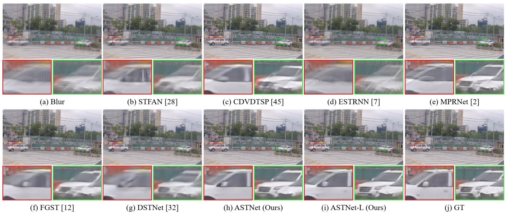
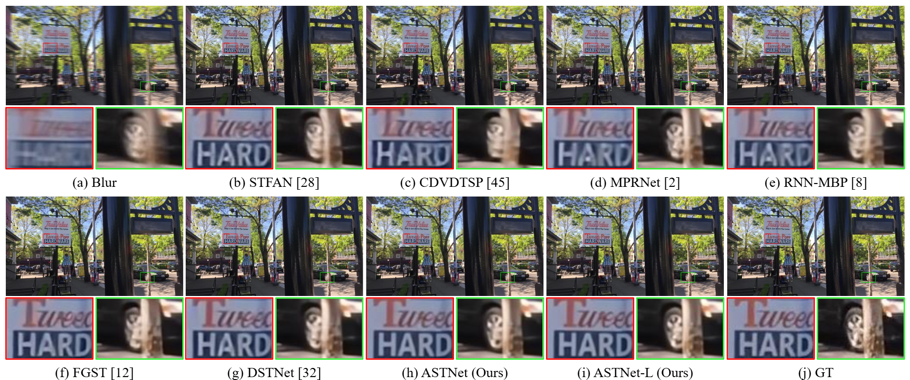
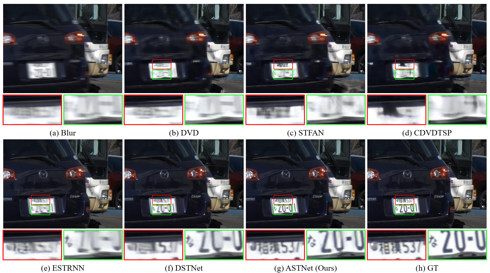
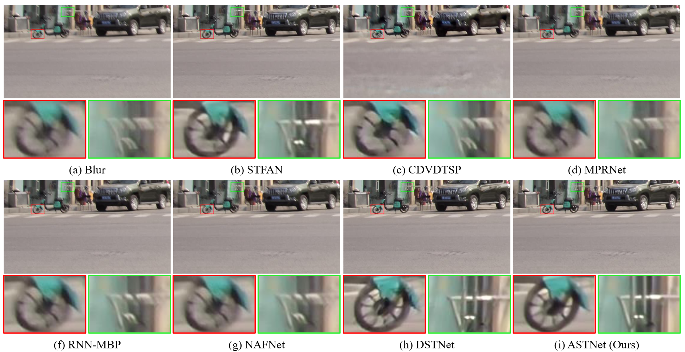

# ASTNet: Adaptive Spatio-temporal Transformer for Efficient Video Deblurring

<hr />

> **Abstract**: *Removing motion blur from videos is a highly challenging task, with existing methods primarily focused on extracting spatio-temporal information from blurred frames and effectively fusing it. Among these, methods based on Transformer have demonstrated particularly outstanding performance in video deblurring tasks. However, the standard self-attention mechanism considers all regions within the feature map, making it difficult to adapt to certain non-uniform blur scenarios. To address this, we propose an adaptive self-attention mechanism that uses the ReLU function and square operation to filter out negative values in attention scores, thereby enhancing the network's ability to focus on locally severely blurred regions. To accommodate global blurring scenarios, we retain the dense attention branch. To further enable fine-grained feature adjustment, we introduce a bidirectional feature enhancement feed-forward network, which can simultaneously extract spatio-temporal features in both horizontal and vertical directions. We also designed a dynamic feature fusion module to adaptively integrate feature information from neighboring frames to avoid error accumulation during feature fusion. Experimental results on synthetic and real datasets show that the proposed method outperforms the current state-of-the-art methods.*
<hr />

## Network Architecture





## Experimental Results
Quantitative evaluations on the GoPro dataset.


Quantitative evaluations on the DVD dataset.


Quantitative evaluations on the BSD dataset.


Deblurring results on the GOPRO dataset.


Deblurring results on the DVD dataset.


Deblurring results on the BSD dataset.


Deblurring results on the Real blurry video.


## Dependencies
- Linux (Tested on Ubuntu 18.04)
- Python 3 (Recommend to use [Anaconda](https://www.anaconda.com/download/#linux))
- [PyTorch 2.0.1](https://pytorch.org/): `pip install torch==2.0.1 torchvision==0.15.2 torchaudio==2.0.2 --index-url https://download.pytorch.org/whl/cu118`
- Install dependent packages :`pip install -r requirements.txt`
- Install DSTNet :`python setup.py develop`

## Get Started

### Pretrained models
- Models are available in  `'./experiments/model_name'`

### Dataset Organization Form
If you prepare your own dataset, please follow the following form like GOPRO/DVD:
```
|--dataset  
    |--blur  
        |--video 1
            |--frame 1
            |--frame 2
                ：  
        |--video 2
            :
        |--video n
    |--gt
        |--video 1
            |--frame 1
            |--frame 2
                ：  
        |--video 2
        	:
        |--video n
```
 
### Training
- Download training dataset like above form.
- Run the following commands:
```
Single GPU
python basicsr/train.py -opt options/train/train_GOPRO.yml
Multi-GPUs
python -m torch.distributed.launch --nproc_per_node=2 --master_port=4321 basicsr/train.py -opt options/train/train_GOPRO.yml --launcher pytorch
```

### Testing
- Models are available in  `'./experiments/'`.
- Organize your dataset(GOPRO/DVD/BSD) like the above form.
- Run the following commands:
```
python basicsr/test.py -opt options/test/test_GOPRO.yml
python basicsr/test.py -opt options/test/test_GOPRO.yml

cd results
python merge_full.py
python calculate_psnr.py
```
- Before running merge_full.py, you should change the parameters in this file of Line 5,6,7,8.
- The deblured result will be in `'./results/dataset_name/'`.
- Before running calculate_psnr.py, you should change the parameters in this file of Line 5,6.
- We calculate PSNRs/SSIMs by running calculate_psnr.py

## Citation
```
@ARTICLE{11318630,
  author={Fu, Ying and Zhou, Chen and Tian, Jianan and Liu, Wei and Wu, Tao},
  journal={IEEE Transactions on Consumer Electronics}, 
  title={ASTNet: Adaptive Spatio-Temporal Transformer for Efficient Video Deblurring}, 
  year={2026},
  volume={72},
  number={1},
  pages={491-506},
  doi={10.1109/TCE.2025.3649654}}
```
## Acknowledgement 
This project is based on [DSTNet](https://github.com/xuboming8/DSTNet), [AST](https://github.com/joshyZhou/AST) and [Restormer](https://github.com/swz30/Restormer).
